# 智能投顾系统

## 项目简介
智能投顾系统是一个集基金研究、因子管理、策略管理、组合产品管理、交易管理和实时访问统计于一体的综合性投顾平台。系统支持公募基金、基金公司、基金经理等多维度数据的查询与分析，提供因子分类、因子有效性分析、策略配置与回测、投资组合管理、自动化交易执行等核心功能。同时，系统还具备实时访问统计和可视化展示，帮助用户全面掌握投资动态与系统使用情况。

---
## 仓库完整地址
https://github.com/choro-fuwa/PatronageSystem

## 功能说明

### 核心功能模块
- 基金研究子系统
- 因子管理子系统
- 策略管理子系统
- 组合产品管理子系统
- 交易管理子系统
- 实时访问统计功能

### 模块交互矩阵

| 模块名称         | 依赖模块         | 数据接口/路径                | 主要功能说明                           |
|----------------|----------------|-----------------------------|----------------------------------------|
| 基金研究        | -              | /api/fund                   | 基金查询、筛选、公司、经理、画像展示   |
| 因子管理        | -              | /api/factor                 | 因子分类、列表、详情、数据、分析       |
| 策略管理        | 因子管理        | /api/strategy               | 策略创建、编辑、参数、统计、筛选       |
| 组合产品管理    | 策略管理        | /api/portfolio              | 产品创建、编辑、列表、详情             |
| 交易管理        | 组合产品管理    | /api/trade                  | 账户、订单、交割单、调仓               |
| 实时访问统计    | -              | /api/ipinfo                 | 统计用户访问IP信息，结合百度地图展示访问分布 |

---

## 关键接口说明

### 1. 基金研究子系统

#### 1.1 获取基金列表
- **接口**：`GET /api/fund/list`
- **参数**：无
- **返回示例**：
  ```json
  {
    "code": 200,
    "message": "操作成功",
    "data": [
      {
        "fundId": 1,
        "fundName": "华夏成长混合",
        "company": "华夏基金",
        "manager": "张三",
        "type": "混合型"
      }
    ]
  }
  ```
- **说明**：获取全部公募基金列表。

#### 1.2 获取基金详情
- **接口**：`GET /api/fund/{id}`
- **参数**：`id`（基金ID，path参数）
- **返回示例**：
  ```json
  {
    "code": 200,
    "message": "操作成功",
    "data": {
      "fundId": 1,
      "fundName": "华夏成长混合",
      "company": "华夏基金",
      "manager": "张三",
      "type": "混合型",
      "nav": 1.234,
      "navDate": "2024-06-01",
      "description": "基金简介……"
    }
  }
  ```
- **说明**：获取指定基金的详细信息。

#### 1.3 搜索基金
- **接口**：`GET /api/fund/search`
- **参数**：
  - `keyword`（string，选填）
  - `fundType`（string，选填）
  - `riskLevel`（string，选填）
- **返回示例**：同上。
- **说明**：按条件搜索基金。

---

### 2. 因子管理子系统

#### 2.1 获取因子分类
- **接口**：`GET /api/factor/categories`
- **参数**：无
- **返回示例**：
  ```json
  {
    "success": true,
    "data": [
      {"id": 1, "name": "价值因子"},
      {"id": 2, "name": "成长因子"}
    ],
    "message": "获取分类成功"
  }
  ```
- **说明**：获取所有因子分类。

#### 2.2 获取因子列表
- **接口**：`GET /api/factor/list`
- **参数**：无
- **返回示例**：
  ```json
  {
    "success": true,
    "data": [
      {"id": 101, "name": "市盈率PE", "category": "价值因子"}
    ],
    "message": "获取因子列表成功"
  }
  ```
- **说明**：获取全部因子列表。

#### 2.3 获取分类下因子
- **接口**：`GET /api/factor/list/category/{categoryId}`
- **参数**：`categoryId`（path参数）
- **返回示例**：同上。
- **说明**：获取指定分类下的因子。

#### 2.4 获取因子详情
- **接口**：`GET /api/factor/detail/{id}`
- **参数**：`id`（path参数）
- **返回示例**：
  ```json
  {
    "success": true,
    "data": {
      "id": 101,
      "name": "市盈率PE",
      "description": "反映公司股价与每股收益的比值"
    },
    "message": "获取因子详情成功"
  }
  ```
- **说明**：获取因子详细信息。

---

### 3. 策略管理子系统

#### 3.1 获取策略列表
- **接口**：`GET /api/strategy/list`
- **参数**：无
- **返回示例**：
  ```json
  {
    "success": true,
    "data": [
      {"id": 1, "name": "价值成长策略", "status": "已启用"}
    ],
    "message": "获取策略列表成功"
  }
  ```
- **说明**：获取所有策略。

#### 3.2 获取策略详情
- **接口**：`GET /api/strategy/{id}`
- **参数**：`id`（path参数）
- **返回示例**：
  ```json
  {
    "success": true,
    "data": {
      "id": 1,
      "name": "价值成长策略",
      "params": {},
      "statistics": {}
    },
    "message": "获取策略详情成功"
  }
  ```
- **说明**：获取策略详细信息。

#### 3.3 新建/编辑策略
- **接口**：`POST /api/strategy`
- **参数**：JSON对象，包含`name`、`params`等
- **返回示例**：
  ```json
  {"success": true, "id": 1, "message": "创建成功"}
  ```
- **说明**：新建或编辑策略。

---

### 4. 组合产品管理子系统

#### 4.1 获取产品列表
- **接口**：`GET /api/portfolio-product/list`
- **参数**：无
- **返回示例**：
  ```json
  {
    "code": 200,
    "message": "操作成功",
    "data": [
      {"id": 1, "name": "稳健组合", "status": "运行中"}
    ]
  }
  ```
- **说明**：获取所有组合产品。

#### 4.2 获取产品详情
- **接口**：`GET /api/portfolio-product/{id}`
- **参数**：`id`（path参数）
- **返回示例**：
  ```json
  {
    "code": 200,
    "message": "操作成功",
    "data": {"id": 1, "name": "稳健组合", "strategy": "价值成长策略"}
  }
  ```
- **说明**：获取组合产品详细信息。

#### 4.3 创建产品
- **接口**：`POST /api/portfolio-product/create`
- **参数**：JSON对象，包含产品信息
- **返回示例**：
  ```json
  {"code": 200, "message": "操作成功", "data": true}
  ```
- **说明**：新建组合产品。

#### 4.4 更新产品
- **接口**：`PUT /api/portfolio-product/update`
- **参数**：JSON对象，包含产品信息
- **返回示例**：同上。
- **说明**：更新组合产品。

---

### 5. 交易管理子系统

#### 5.1 获取账户列表
- **接口**：`GET /api/trade/accounts`
- **参数**：无
- **返回示例**：
  ```json
  [
    {"id": 1, "name": "模拟账户", "balance": 100000}
  ]
  ```
- **说明**：获取所有交易账户。

#### 5.2 创建账户
- **接口**：`POST /api/trade/accounts`
- **参数**：JSON对象，包含账户信息
- **返回示例**：
  ```json
  {"id": 1, "name": "新账户", "balance": 0}
  ```
- **说明**：新建交易账户。

#### 5.3 获取订单列表
- **接口**：`GET /api/trade/orders`
- **参数**：无
- **返回示例**：
  ```json
  [
    {"id": 1001, "fundId": 1, "amount": 1000, "type": "买入", "status": "已成交"}
  ]
  ```
- **说明**：获取所有订单。

#### 5.4 创建订单
- **接口**：`POST /api/trade/orders`
- **参数**：JSON对象，包含订单信息
- **返回示例**：
  ```json
  {"id": 1002, "fundId": 1, "amount": 500, "type": "买入", "status": "待成交"}
  ```
- **说明**：新建订单。

#### 5.5 获取持仓列表
- **接口**：`GET /api/trade/positions`
- **参数**：无
- **返回示例**：
  ```json
  [
    {"id": 1, "accountId": 1, "fundId": 1, "amount": 1000}
  ]
  ```
- **说明**：获取所有持仓。

#### 5.6 账户调仓
- **接口**：`POST /api/trade/account/rebalance`
- **参数**：JSON对象，包含调仓计划
- **返回示例**：
  ```json
  "success"
  ```
- **说明**：对账户进行调仓。

#### 5.7 组合调仓
- **接口**：`POST /api/trade/rebalance/plan`
- **参数**：JSON对象，包含调仓计划
- **返回示例**：
  ```json
  "success"
  ```
- **说明**：对组合进行调仓。

---

### 6. 实时访问统计子系统（百度地图IP统计）

#### 6.1 获取访问IP信息
- **接口**：`GET /api/ipinfo`
- **参数**：无
- **返回示例**：
  ```json
  [
    {"ip": "123.123.123.123", "location": "北京", "time": "2024-06-01 10:00:00", "count": 5}
  ]
  ```
- **说明**：获取用户访问IP信息，统计访问来源，结合百度地图进行可视化展示。

---

## 前端功能模块

| 主模块         | 主要页面/组件           | 功能描述                           |
|--------------|----------------------|----------------------------------|
| 基金研究      | 基金列表、公司、经理、画像 | 展示基金、公司、经理、基金画像信息   |
| 因子管理      | 因子分类、列表、详情     | 因子管理与分析                     |
| 策略管理      | 策略列表、详情、参数     | 策略配置与管理                     |
| 组合产品管理  | 产品列表、详情、编辑     | 组合产品管理                       |
| 交易管理      | 账户、订单、调仓         | 交易相关操作                       |
| 实时访问统计  | 访问统计地图、IP分布     | 展示用户访问分布，结合百度地图可视化 |

---

## 后端功能模块

| 主模块         | 子模块/服务           | 接口示例                | 功能描述                           |
|--------------|--------------------|------------------------|----------------------------------|
| 基金研究      | 基金、公司、经理      | GET /api/fund           | 基金、公司、经理、画像数据查询      |
| 因子管理      | 因子分类、数据、分析   | GET /api/factor         | 因子管理与分析                     |
| 策略管理      | 策略配置、参数、统计   | POST /api/strategy      | 策略创建、编辑、参数、统计          |
| 组合产品管理  | 产品管理              | POST /api/portfolio     | 产品创建、编辑、列表、详情          |
| 交易管理      | 账户、订单、调仓       | POST /api/trade/account | 账户、订单、交割单、调仓管理         |
| 实时访问统计  | IP信息采集、地理定位   | GET /api/ipinfo         | 采集用户访问IP，统计并结合百度地图展示 |

---

## 安装部署指南

### 环境要求
- JDK 17+
- Node.js 16+
- MySQL 8.0+
- Redis

### 后端部署
1. 克隆项目到本地
2. 配置数据库
   ```sql
   # 创建数据库
   CREATE DATABASE patronage_system;
   use patronage_system;
   source patronage_system.sql;
   ```
3. 修改配置文件
   - 配置 `application.yml` 中的数据库连接信息
   - 配置 Redis 连接信息
4. 执行 Maven 构建
   ```bash
   mvn clean install
   ```
5. 运行项目
   ```bash
   mvn spring-boot:run
   ```

### 前端部署
1. 进入前端项目目录
   ```bash
   cd patronage-vue
   ```
2. 安装依赖
   ```bash
   npm install
   ```
3. 开发环境运行
   ```bash
   npm run dev
   ```

## 开发成员及分工
| 成员         | 分工           |
|--------------|--------------------|
| 林佳      | 交易管理子系统、实时访问统计功能      |
| 刘航      |  基金研究子系统  |
| 史郁洁      | 因子管理子系统、控制台板块   |
| 梁瑞鑫  | 策略管理子系统            |
| 刘晓苒      | 组合产品管理子系统       |


## 使用说明

1. **登录/注册系统**  
   - 打开系统首页，输入用户名和密码，点击“登录”按钮进入系统主界面。
   - 没有账号可点击“注册”按钮，填写用户名、密码等信息完成注册。
   - 登录后可自动跳转到仪表盘首页。
   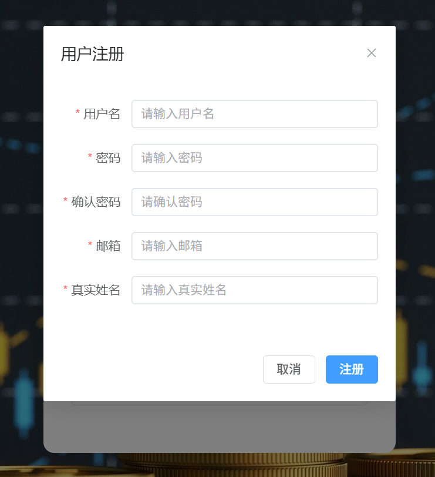
   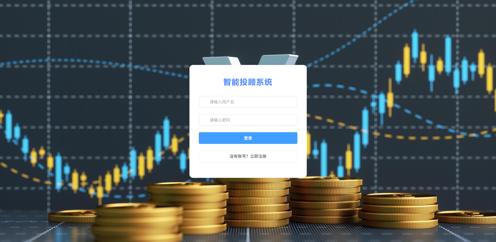

2. **查看仪表盘**  
   - 登录后进入仪表盘首页，可直观查看基金总数、用户数量等核心数据。
   - 页面会推送实时财经快讯，帮助用户快速了解市场走向。
   - 可通过点击侧边栏，快速跳转到相关功能模块。
   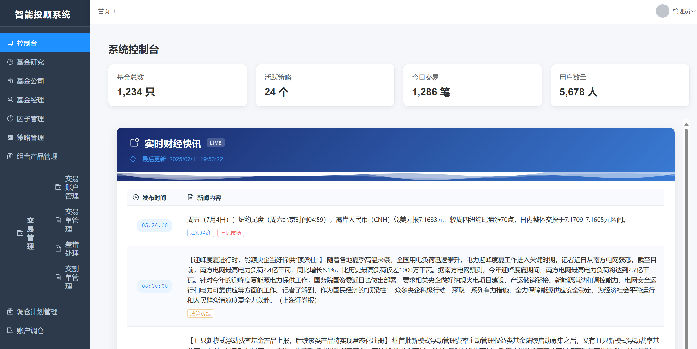

3. **基金研究**  
   - 在左侧导航栏点击“基金研究”、“基金公司”、“基金经理”进入相关页面。
   - 可浏览全部公募基金列表，支持按类型、风险等级等条件筛选。
   - 点击“查看基金”按钮可查看基金详情，包括公司信息、基金经理信息及基金画像。
   - 支持关键词搜索、分页浏览。
   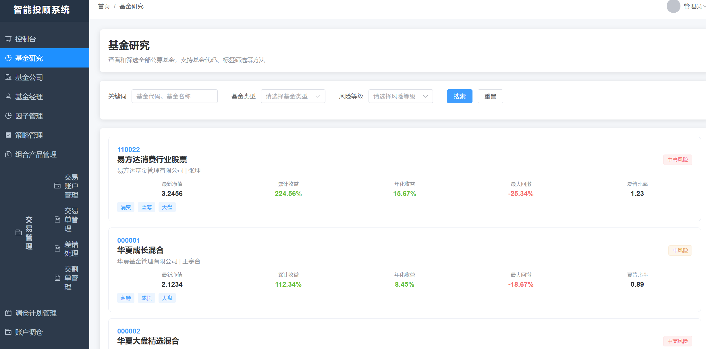
   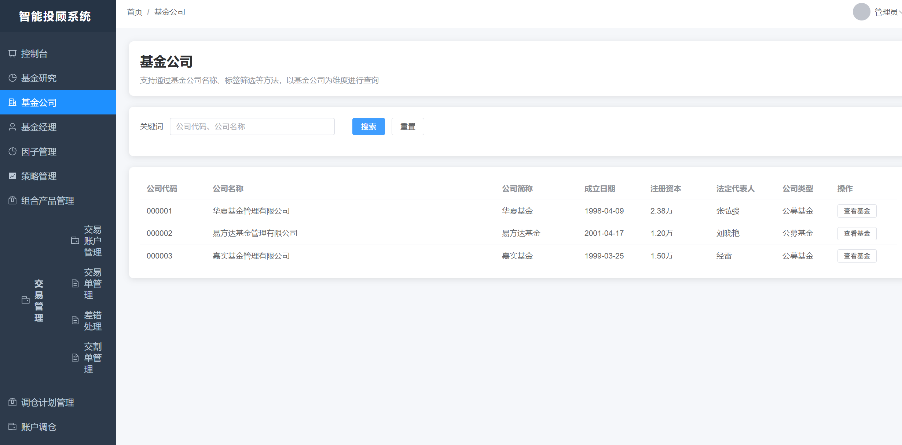
   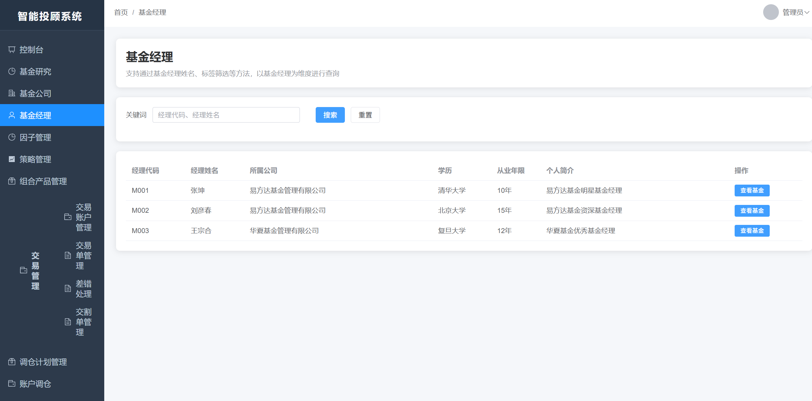

4. **因子管理**  
   - 点击“因子管理”进入因子分类、因子列表页面。
   - 可查看、增删改查因子详情，支持因子分类树管理。
   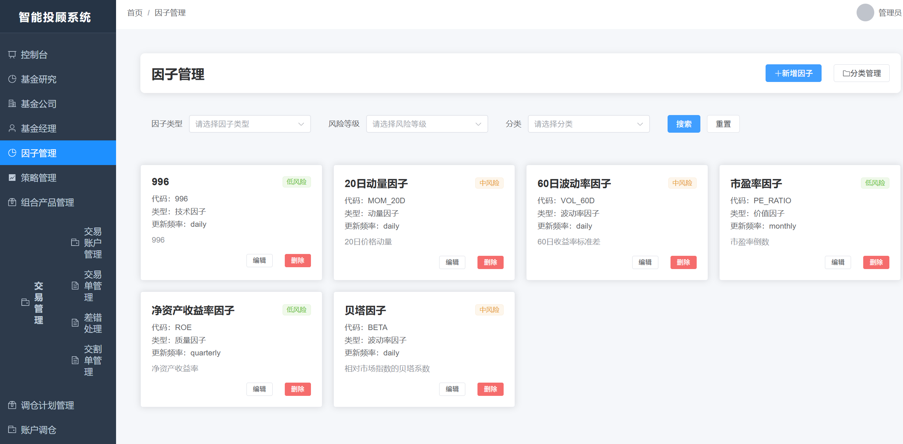
   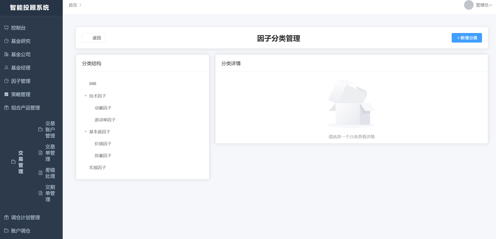

5. **策略管理**  
   - 点击“策略管理”进入策略列表页面。
   - 可新建、编辑、删除、查询策略，配置参数，查看策略统计信息和详情。
   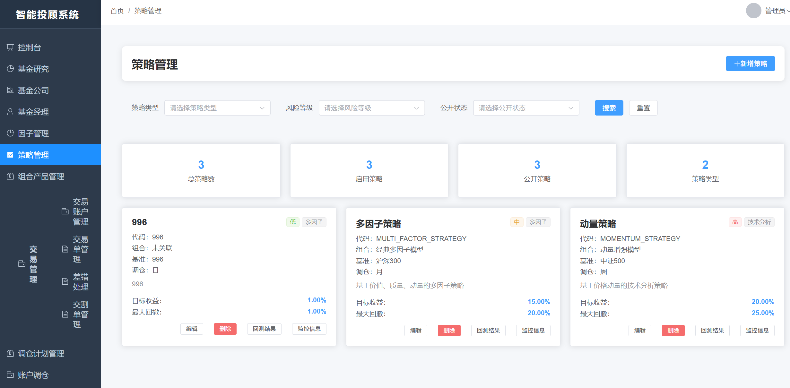

6. **组合产品管理**  
   - 点击“组合产品管理”进入产品列表页面。
   - 可新建、编辑、删除、查询组合产品，查看产品详情及持仓分布。
   

7. **交易管理**  
   - 点击“交易管理”进入交易账户、订单、交割单等功能页面。
   - 可进行账户管理（新建、查询、删除）、下单（买入/卖出）、查看订单和交割单、执行组合或账户调仓操作。
   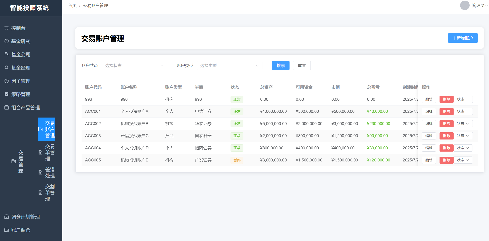
   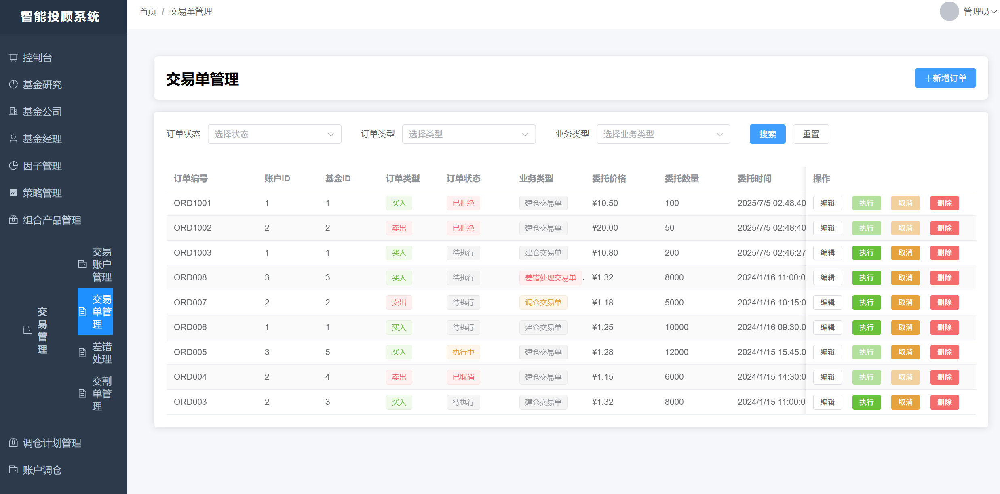
   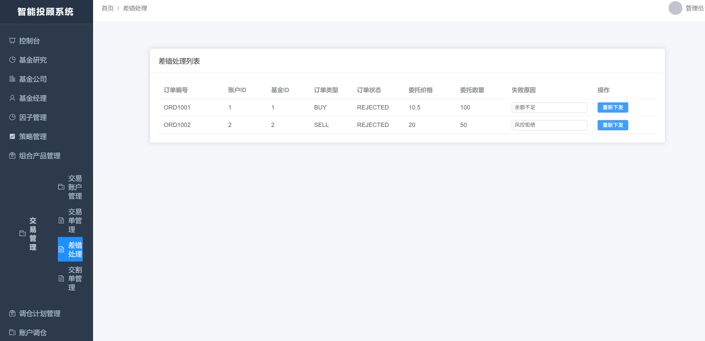
   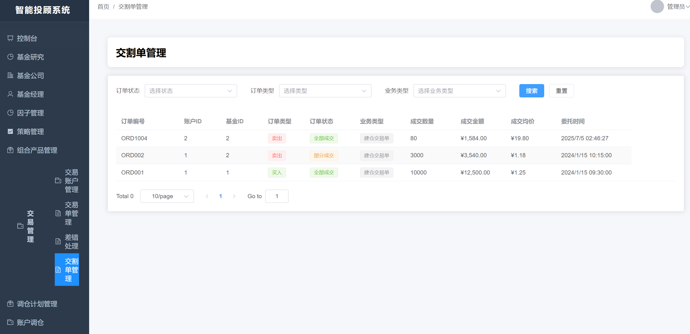
   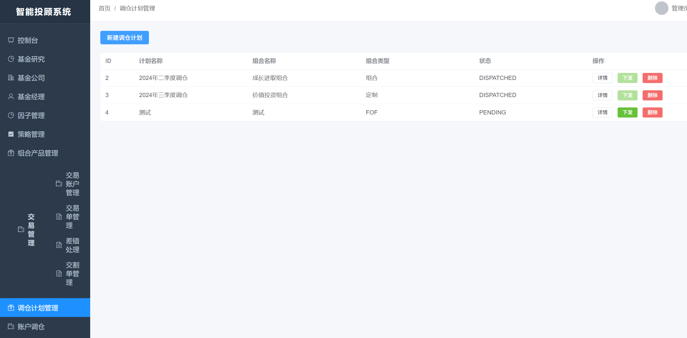
   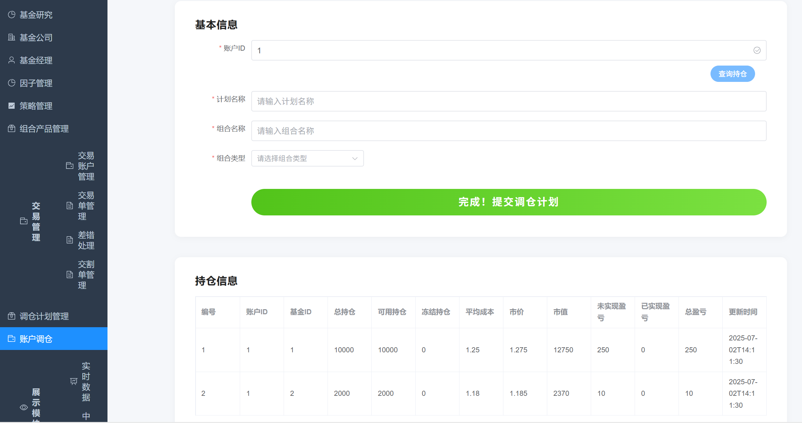

8. **实时访问统计**  
   - 在左侧导航栏点击“实时访问统计”，进入访问统计页面。
   - 可通过中国地图动态显示用户访问分布，直观可视化。
   - 支持点击“跳转到百度地图实时访问统计页面”，查看更多详细数据。
   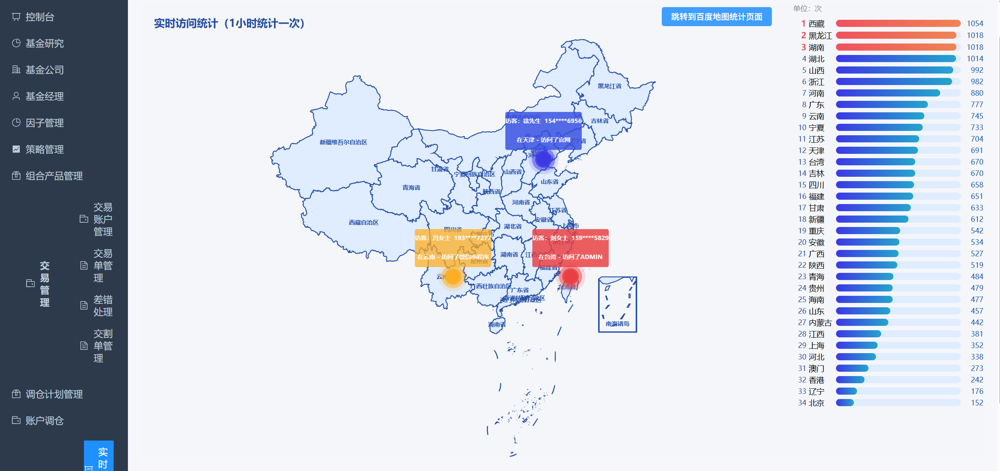
   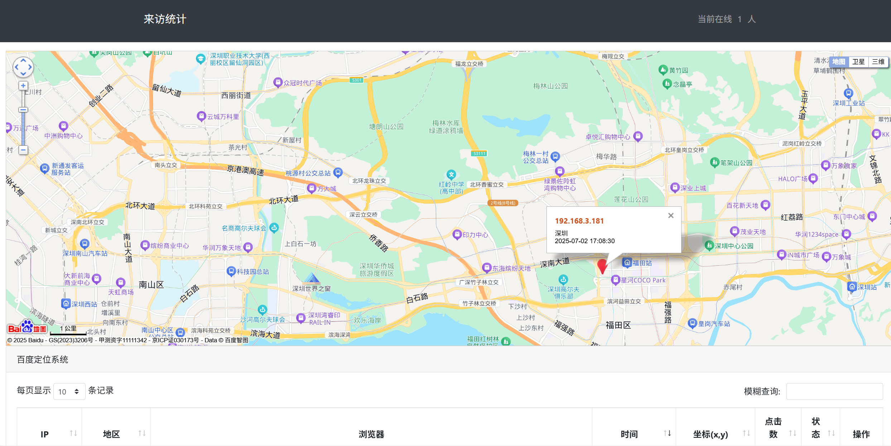

9. **退出登录**  
   - 点击右上角用户头像或菜单，选择“退出登录”安全离开系统。
   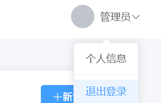

